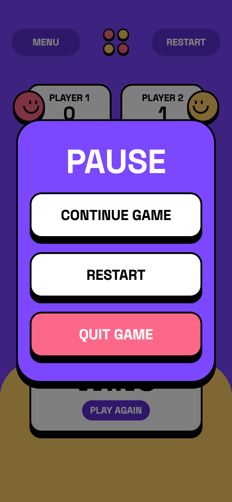
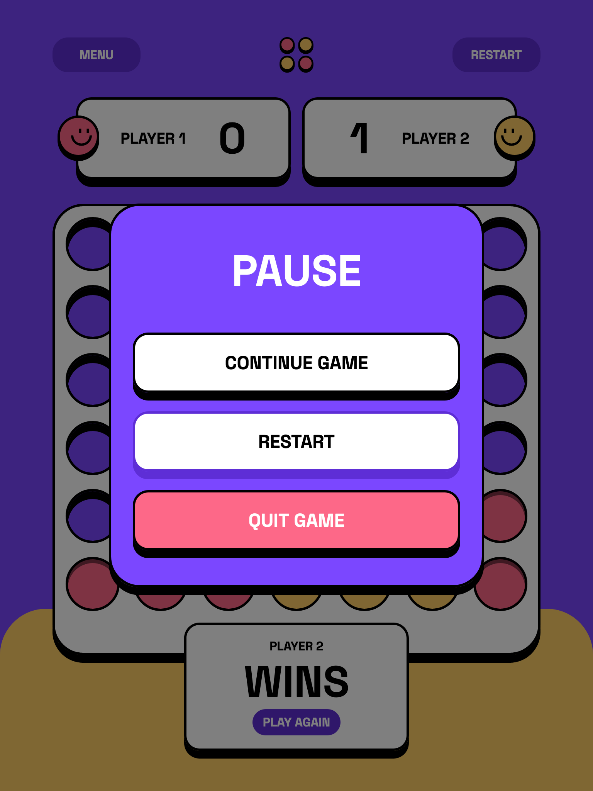
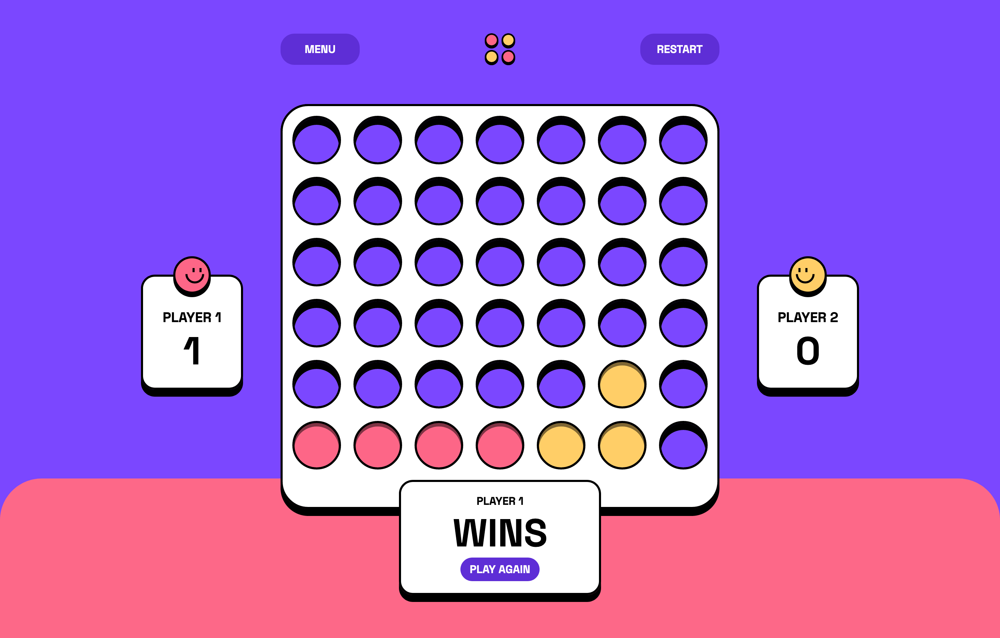

# Connect Four

Connect Four game built using ReactJS, StyledComponents, and RadixUI primitives.

### Mobile

### Tablet

### Desktop

### Links

- Live Site URL: [https://nurira.github.io/connect-four](https://nurira.github.io/connect-four)

## Built with

- Semantic HTML5 markup
- CSS custom properties
- Flexbox
- CSS Grid
- Mobile-first workflow
- [React](https://reactjs.org/)
- [Styled Components](https://styled-components.com/)
